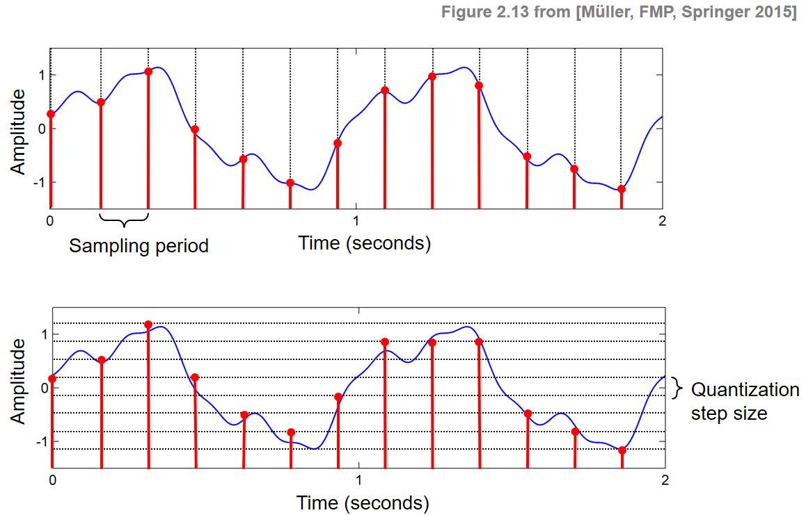
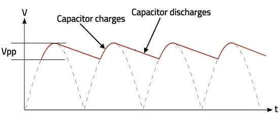

信号处理 101
=====

本实验经常要和示波器打交道，示波器通过将输入的电信号经过放大、模数转换、存储等步骤，最终在屏幕上实时
绘制出信号的波形图，帮助实验直观地分析信号的频率、幅度、相位等特性。下面简要介绍一些信号处理的相关概念，方便后续的学习。

----------------------------
采样与量化
----------------------------

采样和量化是数字信号处理中的两个基本步骤。采样是指以固定时间间隔对连续信
号进行离散化，获取信号在各个时间点的值；量化则是将采样得到的连续幅度值转换为
离散的数字值。示波器通过采样和量化将模拟信号转换为数字信号，以便在屏幕上显示
和分析波形，从而实现对电信号的精确测量和分析。在一些细分的电子学领域，量化参
数也被称为是道数（coder）。

示波器的采样率决定了我们能否清楚地看到信号真实的样子。根据 **Shannon-Nyquist 定理**：
为了准确重建一个连续时间信号，采样率必须至少是信号最高频率的两倍。

.. math::

   f_s \geq 2 f_{\text{max}}

如果采样率低于这个阈值，将会导致 **混叠现象 (aliasing)**，从而无法正确恢复原始信号。

为了优化存储和计算性能，可以使用 **降采样 (downsampling)** 和 **上采样 (upsampling)**：

- **降采样**：减少数据点数量，降低数据密度，减少计算复杂度。
- **上采样**：增加数据点数量，提高数据分辨率。可以使用 Python 中的 `scipy.interpolate.interp1d` 函数进行样条插值。

无论是上采样还是下采样，其频率选择都应严格遵循 Nyquist-Shannon 定理，以确保信号的完整性和准确性。

----------------------------
工频干扰、直流信号与噪声分类
----------------------------

直流信号可以通过对交流信号进行整流、滤波来获得。低通滤波器用于去除高频成分，仅保留低频直流成分。
然而，噪声很难被完全滤除，大部分直流信号仍会存在 **波纹 (ripple)**。

- **低频段噪声**：来源于未能完全滤除的交流成分，主要包括工频噪声及其谐波噪声（如 100 Hz、150 Hz）。
- **高频段噪声**：来源于开关电源内部开关器件的切换，频率范围在几十千赫兹到几兆赫兹之间。

.. figure:: images/high_freq_ripple.png
   :align: center
   :alt: 高频波纹和热噪声

----------------------------
傅里叶变换与 Welch 方法
----------------------------

**傅里叶变换** 将一个复杂信号分解为多个简单的正弦波和余弦波的叠加。对于离散信号，使用 **离散傅里叶变换 (DFT)**：

.. math::

   X[k] = \sum_{n=0}^{N-1} x[n] \cdot \exp\left(-j 2 \pi \frac{k n}{N}\right)

**快速傅里叶变换 (FFT)** 是 DFT 的高效算法，将计算复杂度从 :math:`O(N^2)` 降低到 :math:`O(N \log N)`。

### **Welch 方法**

Welch 方法用于估计信号的 **功率谱密度 (Power Spectrum Density, PSD)**，基本步骤包括：

1. 将信号分段。
2. 对每段加窗（如矩形窗或海明窗）。
3. 对每段进行傅里叶变换。
4. 计算频谱功率并平均。

分段和加窗处理有助于减少 **频谱泄漏 (Spectrum Leakage)**，提高功率谱估计的准确性和稳定性。

----------------------------
直流耦合与交流耦合
----------------------------

- **直流耦合 (DC Coupling)**：直接将输入信号连接到示波器放大器，保留直流分量和交流分量。
- **交流耦合 (AC Coupling)**：通过高通滤波器去除低频分量，仅保留高频部分。

### **直流与交流的区别：**

- **直流信号**：稳定不变的波形。
- **交流信号**：幅度或方向随时间变化的信号。

在实际测量中，根据分析需求选择合适的耦合方式。
